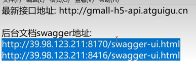

### 项目描述
- 参考尚硅谷项目尚品汇
- Vue版本为2.6.14

### 知识点
> - 其实清除默认样式可以放在App.vue全局下，一个个引入麻烦很
> - 

### 教程：

### TODO:
- [x] AJAX基础(20221212-20221213)
- [ ] Webpack基础
- [ ] axios基础
- [ ] promise基础
- [ ] export default命令
- [ ] select表单如何优化? 初始化提示?
- [ ] 熟悉element-ui组件